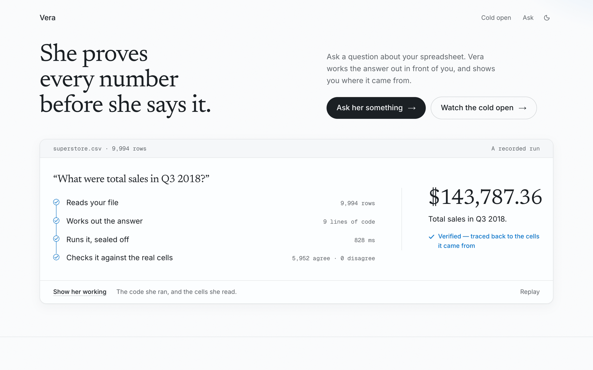
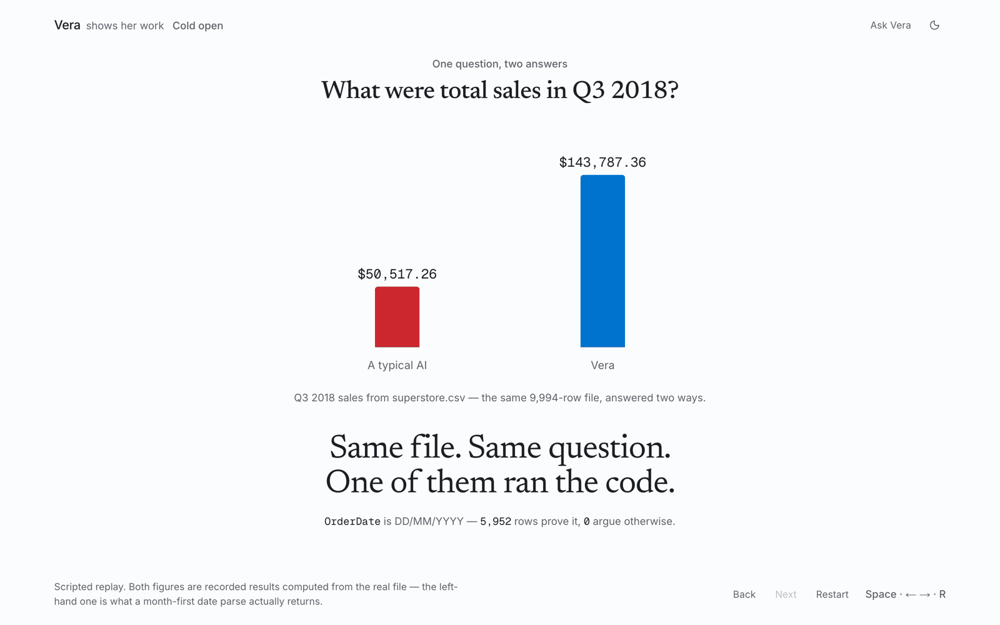
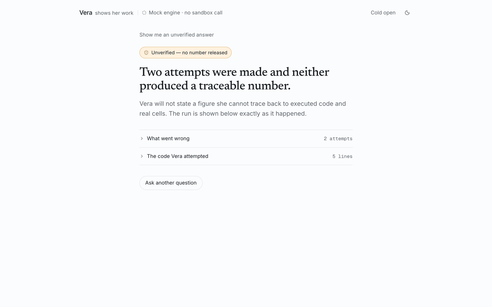
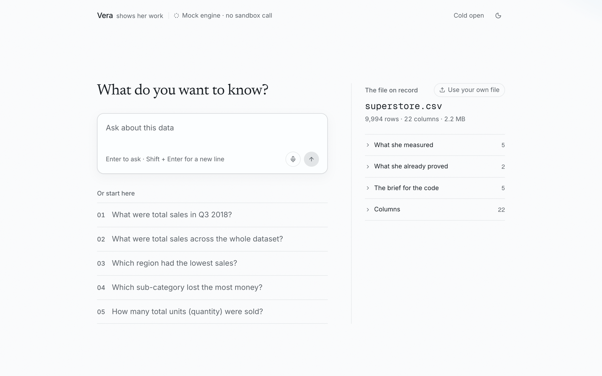
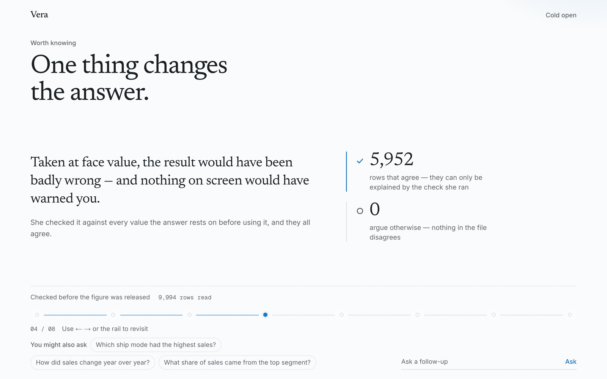

# Vera

**An AI business analyst that proves every number before she says it.**

Ask a question about your spreadsheet. Vera profiles the file, writes the calculation, runs it
sealed off from everything else, and shows you the number next to the code that produced it and the
actual cells it read. If she can't trace a figure back to real cells, she shows **no figure at all**
and tells you why.



Built for the Daytona HackSprint with Braintrust, 24 July 2026. Runs locally, in mock mode, with no
API keys.

```bash
pnpm install && pnpm dev
```

---

## The argument

One question. One file. Three answers. **None of them crash, and nothing on screen tells you which
one you got.**

The file is a real 9,994-row Superstore orders export. The question is *"what were total sales in
Q3 2018?"*

| Answer | Where it comes from | Why it's wrong |
|---|---|---|
| `$50,517.26` | a plain `pd.to_datetime` on `OrderDate` | pandas defaults to month-first. **5,952 of 9,994 rows** aren't valid month-first dates, so they're dropped. Silently. |
| `$131,098.53` | the file's own `Order Quarter` column | it's right there in the file, and it **disagrees with the real order dates on 2,889 rows** |
| `$143,787.36` | the dates read correctly, then checked | 740 rows match. This is the one. |

That's the whole problem in three lines. Two of those answers come out of code that runs perfectly
cleanly. An assistant that just states a number gives you no way to tell them apart — and it will
state any of the three with exactly the same confidence.

So before any model sees the file, Vera counts:

```
OrderDate is DD/MM/YYYY
  5,952 values have a first component above 12, which cannot be a month.
  0 values argue the other way.

"Order Quarter" disagrees with the quarter of "OrderDate"
  2,889 of 9,994 rows. Code that trusts it runs cleanly and returns a wrong number.
```

Both facts go into the prompt **with their counts**. The model then writes
`pd.to_datetime(df["OrderDate"], format="%d/%m/%Y")` and says why: *derive the quarter from the
date, not from the unreliable column.* Every claim above is a count you can re-derive yourself in
about four seconds — the snippet is at the top of
[`components/landing/recorded.ts`](components/landing/recorded.ts).

You can watch this play out at [`/open`](app/open/page.tsx):



## How she actually works

1. **Profile the file — deterministically, before any model is involved.** Column kinds, date
   formats, and cross-column contradictions, each carrying the counts that prove it. A format that
   *can't* be proven is reported as ambiguous, never resolved by guessing.
2. **Write the calculation.** Fireworks gets the profile and sample rows — never the whole file —
   and returns pandas under a structured-output schema. A policy pass rejects code that parses a
   proven date column without its proven format, which is why the `%d/%m/%Y` above isn't a
   stylistic preference.
3. **Run it sealed off.** The program executes in a Daytona sandbox against the real file — a
   separate machine from yours, holding nothing but the uploaded dataset, under a hard
   per-execution timeout. Model-written code never touches your filesystem.
4. **Trace it back.** The safeguard checks that the code exited 0, returned a finite value, and that
   the value is attributable to named columns of the real file. It then quotes the actual cells back
   at you, with line numbers.
5. **Only then, say it.** A verified finding becomes a short presentation, narrated out loud by
   ElevenLabs.

If step 3 or 4 fails, the error goes back to Fireworks and she tries again, twice. If it still fails,
this is what you get — and this screen is the product working, not the product breaking:



There is no guess fallback. `Finding` is a discriminated union and the `unverified` branch has no
`value` field at all, so leaking an unproven number is a **compile error**, not a code-review
question.

## What "verified" honestly means

Two different claims. Vera never blurs them, because the distinction *is* the product.

**1. Live grounding — per answer, real.**
The number came from code that actually executed on the real cells of your file. The code, the exit
status, the timing and the cells it read are all on screen. This holds for any question on any file
you give her.

**2. Measured accuracy — aggregate, pre-computed.**
On a fixed 21-question benchmark over the demo file, Vera scores **21/21 (100%)** against **10/21
(47.6%)** for a no-execution baseline. That is a dashboard figure from one recorded run on
2026‑07‑24, not a per-answer guarantee.

The baseline is deliberately a fair fight, not a strawman. Vera's model never sees the whole file
either — it gets the profile plus sample rows. The baseline gets **identical context** and simply
isn't allowed to execute. Same model, same prompt; one of them runs code. It still missed 11 of the
21: all five date-derived questions, plus total profit, profit margin, West-region sales,
Technology profit, the Tables loss and average discount.

**What Vera does not claim:** that she can tell you a cleanly-executing number is the *wrong answer
to your question*. At demo time there is no answer key. What she can do is refuse to release a
number she cannot trace, and prove the schema facts her code relied on. Anyone who tells you their
agent does more than that on arbitrary data is describing the thing that doesn't exist yet.

## Run it

```bash
pnpm install
pnpm dev
```

**No API keys. No `.env.local`. No network calls.** Mock mode is the default and the whole product
runs end to end without one — landing, cold open, ask, working screen, verified and unverified
states, and the narrated deck.

Three routes: `/` the landing page, `/open` the cold open, `/ask` the product.



<details>
<summary><strong>Running it live (spends credits)</strong></summary>

Copy `.env.example` to `.env.local`, fill in the four keys, then:

```bash
VERA_MOCK=0 pnpm dev
```

Every money-spending route is rate-limited, retries are capped at 2, and there's a hard ceiling of
50 paid runs per server process — see `LIMITS` in [`lib/config.ts`](lib/config.ts).

A live session leaves a warm sandbox running, which bills until you delete it:

```bash
set -a; . ./.env.local; set +a
VERA_LIVE=1 VERA_SANDBOX_ID=<id> pnpm vitest run tests/reap.live.test.ts
```

That test polls until the sandbox is *gone from the list*, because a `delete()` that returns
cleanly is not proof it's gone.

</details>

## Verify the claims yourself

Nothing below spends a cent.

```bash
pnpm test                       # unit + contract tests; live tests are gated and skip by default
python3 eval/verify-answers.py  # recomputes all 21 benchmark answers from the CSV with pandas
```

The benchmark run is checked in whole — every question, both answers, both scores, and the
per-question misses — at [`eval/results.json`](eval/results.json). The
[Braintrust experiment](https://www.braintrust.dev/app/Padzy/p/Vera%20Accuracy%20Benchmark/experiments/vera-vs-baseline-2026-07-24T20-28-28-903Z)
is the same run, live. Every figure on the landing page is declared with its provenance in
[`components/landing/recorded.ts`](components/landing/recorded.ts) and re-derivable from the CSV
with the snippet in that file's header.

Live end-to-end checks exist and are gated behind `VERA_LIVE=1` so they can never run by accident:

```bash
set -a; . ./.env.local; set +a
VERA_LIVE=1 VERA_MOCK=0 pnpm vitest run tests/live-e2e.test.ts
```

## Architecture

```
  Question + CSV
        │
        ├──► deterministic profiler ──► proven schema facts, each with its counts
        │                               (no model involved, nothing guessed)
        ▼
    Fireworks ──writes pandas──► Daytona sandbox ──executes──► result
    (profile + sample rows,       (separate machine,               │
     never the whole file)         hard timeout)                   │
                                                                   │
              the safeguard: exit 0? finite value?                 │
              every column traceable to the real file? ────────────┤
                                                                   │
        pass ─► number + code + source cells + evidence ───────────┤
        fail ─► stderr back to Fireworks, retry (max 2) ───────────┘
        still failing ─► no number released, and it says why
```

TypeScript and Next.js throughout; API routes are the backend. The **only** Python is the analysis
code generated to run inside the sandbox. It runs locally on purpose — a serverless function would
time out mid-sandbox-call.

A verified finding becomes a narrated deck: the headline figure, then one slide per fact she
proved, then the code and the cells. Every figure on every slide came out of the same executed run.



## Repo map

| Path | What lives there |
|---|---|
| [`lib/types.ts`](lib/types.ts) | the contract. `Finding` is a discriminated union; `unverified` has no `value` field, so an unproven number can't compile |
| [`lib/profile/profiler.ts`](lib/profile/profiler.ts) | the deterministic profiler — proves date formats by counting, cross-checks period columns, refuses to resolve an ambiguous one |
| [`lib/verify.ts`](lib/verify.ts) | the safeguard. Pure, so it's exhaustively testable without spending anything. Checks provenance, not correctness |
| [`lib/codegen/`](lib/codegen) | the generated-Python policy — what the model is allowed to write, and why |
| [`lib/analyst.ts`](lib/analyst.ts) | the one-line mock ↔ real swap point |
| [`lib/deck.ts`](lib/deck.ts) | turns a verified finding into slides with narration beats |
| [`lib/daytona/`](lib/daytona), [`lib/fireworks/`](lib/fireworks), [`lib/braintrust/`](lib/braintrust), [`lib/voice/`](lib/voice) | the four integrations |
| [`eval/`](eval) | 21 hand-verified questions, the pandas answer-key checker, the recorded benchmark |
| [`data/superstore.csv`](data) | the demo dataset, read server-side — the client never receives it |
| [`DESIGN.md`](DESIGN.md) | the design system, v4 and binding |
| [`tasks/lessons.md`](tasks/lessons.md) | every bug that got past a green test suite, and what it taught |

## The sponsor stack, and what each piece actually does

**Daytona — the isolation.** One warm sandbox held as a server-side singleton and reused across
questions, so the second question doesn't pay for a cold start. The dataset is uploaded once per
sandbox lifetime. A liveness probe recreates a dead handle rather than failing the run,
per-execution timeouts are enforced, and teardown is explicit. This is the piece that makes running
model-written code against your data a reasonable thing to do at all.

**Fireworks — the brain.** OpenAI-compatible client on
`accounts/fireworks/models/glm-5p2`, confirmed against the live model list rather than guessed.
Structured output under a JSON schema, validated with zod at the boundary. It writes the pandas and
the prep program; it never sees the file.

**Braintrust — the proof.** The offline 21-question benchmark behind the accuracy figure, and the
trace log for live runs. 102 model calls in the recorded experiment, scored with a numeric-tolerant
grader (relative epsilon 1e-4) so a rounding difference isn't counted as a miss.

**ElevenLabs — the voice.** Vera presents the finding out loud, one call per narrated slide with the
beats batched into a single request. Only a *verified* finding can be spoken, and that's enforced by
the type system rather than by a check somebody might forget.

**CodeRabbit and Herdr — dev-time, not product.** Herdr ran Claude, Codex and Cursor agents in
parallel isolated worktrees behind a single merge gate. CodeRabbit reviewed the earlier PRs; it
skipped the largest one for exceeding its 100-file limit, which is tracked in the open issues rather
than glossed over.

## Known limits

Stated here rather than left for you to find:

- Mock mode answers from a recorded engine, not a model. It's for demonstrating the flow and the
  shape of the UI — the live path is the one that proves anything.
- The benchmark is 21 questions over one file. It measures this dataset, not data analysis.
- One finding per deck. Cost is linear in findings and the ceiling is deliberate — see
  `maxFindingsPerDeck` in [`lib/config.ts`](lib/config.ts).
- `/ask` has no auth. It's a local demo; don't expose it.

## Licence

MIT.
